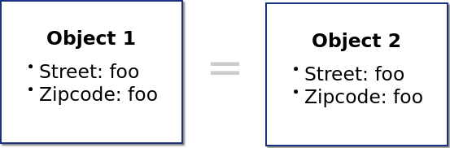
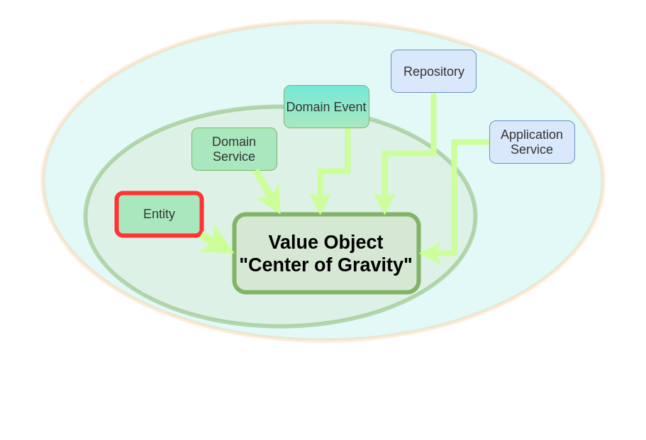
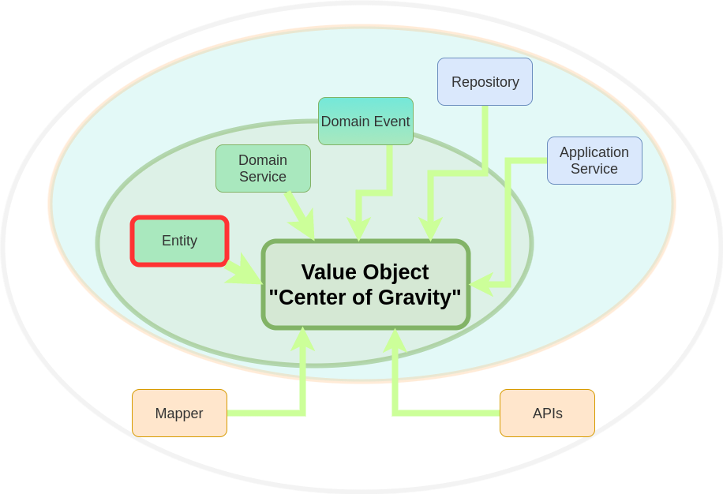

# Value Objects
## on steroids

Patrick Drechsler

`#dwx2018`

<i class="fa fa-calendar" aria-hidden="true"></i> 25.06.2018&nbsp;&nbsp;&nbsp;&nbsp;
<i class="fa fa-twitter" aria-hidden="true"></i> @drechsler&nbsp;&nbsp;&nbsp;&nbsp;
<i class="fa fa-github" aria-hidden="true"></i> draptik

x---

**Patrick Drechsler**

- C# Entwickler bei Redheads Ltd.
- aktuelle Schwerpunkte: DDD, FP, Cloud
- Softwerkskammer
<!-- 

 -->

Note: 
Wo geht die Reise hin?

- Was ist ein Value Object?
- Wie nutzt man Value Objects?
- Fallstricke
- Killer Features // <- In die Liste aufnehmen?
- On Steroids

x---

## Domain Driven Design


Note: 
- Alle Buecher (bis auf Distilled) > 500Seiten
- schließt die Kluft zwischen
    - **Fachlichkeit** (Kunden-Vokabular) und 
    - **techn. Implementierung** (IT-Vokabular)

x---

```csharp
public class Konto
{
    public int Kontostand { get; private set; } = 0;

    public void Einzahlen(int geld) 
    { 
        Kontostand += geld;
    }
}
```

<pre>
<code data-noescape data-trim class="lang-csharp hljs fragment" data-fragment-index="1">
[Fact]
public void Kontostand_ist_nach_Einzahlung_groesser_als_davor()
{
    var konto = new Konto();
    var before = konto.Kontostand;
    <span class="mycodemark-always">konto.Einzahlen(-10); // <---------------------- AUTSCH!</span>
    konto.Kontostand.Should().BeGreaterThan(before);
}
</code>
</pre>

x---

- Problem: **Signatur lügt!** (Geld ist kein Integer)
- Willkommen in der Welt der Antipattern...<!-- .element: class="fragment" data-fragment-index="1" -->

**Primitive Obsession**<!-- .element: class="fragment" data-fragment-index="2" -->

*Like most other [code] smells, primitive obsessions are born in moments of weakness. **"Just a field for storing some data!"** the programmer said. Creating a primitive field is so much easier than **making a whole new class**, right?*<!-- .element: class="fragment" data-fragment-index="2" -->

<span class="small fragment" data-fragment-index="2"> https://sourcemaking.com/refactoring/smells/primitive-obsession</span> 

Note:
- Im Zitat steckt schon ein Lösungsansatz ('making a new class')
- Outside-In Approach: Aendern wir zuerst alle Signaturen in der Konto-Klasse...

x---

<pre>
<code data-noescape data-trim class="lang-csharp hljs">
public class Konto
{
    public Geld Kontostand { get; private set; } = new Geld(0);

    public void Einzahlen(<span class="mycodemark-always">Geld geld</span>) 
    { 
        Kontostand = <span class="mycodemark-always">new Geld</span>(Kontostand.Betrag + geld.Betrag);
    }
}
</code></pre>

Geld Klasse existiert noch nicht...<!-- .element: class="fragment" data-fragment-index="1" -->

x---

```csharp
public class Geld
{
    public int Betrag { get; }                       // <- 1

    public Geld(int betrag)                          // <- 2
    {
        if (!IsValid(betrag))                        // <- 3
        {
            throw new InvalidGeldException(betrag.ToString());
        }

        this.Betrag = betrag;                        // <- 2'
    }

    private bool IsValid(int betrag) => betrag >= 0; // <- 3'
}
```
- Es kann nur gültige Geld-Objekte geben<!-- .element: class="fragment" data-fragment-index="1" -->
- Wert kann nicht verändert werden<!-- .element: class="fragment" data-fragment-index="1" -->

x---

## Immutability

- einfacher zu Erstellen & Testen
- keine Seiteneffekte
- keine Null References
- Thread Safe
- verhindert Temporal Coupling

x--

```csharp
[Fact]
public void Geld_schmeisst_wenn_Betrag_zu_gross()
{
    var max = Int32.MaxValue;
    
    Action action = () => new Geld(max + 1);
    
    action.Should().Throw<InvalidGeldException>();
}
```

vernünftige Exception!

(bessere Implementierung folgt)

x--

Vorschau: mehr Verhalten in die Geld-Klasse packen

```csharp
public class Geld
{
    public int Betrag { get; }

    // ...

    public Geld Add(Geld geld)
    {
        try 
        {
            return new Geld(this.Betrag + geld.Betrag);
        }
        catch 
        {
            throw new InvalidGeldException(
                $"Ups. Can't add {geld.Betrag} to {Betrag}!");
        }
    }
}
```

x--

```csharp
[Fact]
public void Geld_laesst_sich_addieren()
{
    var geld1 = new Geld(1);
    var geld2 = new Geld(10);

    var geld3 = geld1.Add(geld2); // geld1, geld2 werden nicht verändert

    geld3.Betrag.Should().Be(11);
}
```

x---

Geld ist mehr als nur **Betrag**


Fügen wir **Währung** zur Klasse **Geld** hinzu...

x---

```csharp
public class Geld
{
    public int Betrag { get; }
    public Waehrung Waehrung { get; } // <---------------- NEU

    public Geld(int betrag, Waehrung waehrung) 
    {
        if (!IsValid(betrag, waehrung))
        {
            throw new InvalidGeldException();
        }
        this.Betrag = betrag;
        this.Waehrung = waehrung; // <-------------------- NEU
    }

    private bool IsValid(int betrag, Waehrung waehrung) 
        => betrag >= 0 && waehrung != Waehrung.Undefined;
}
```
- kann nicht verändert werden
- ungültige Geld Objekte nicht möglich

x---

<pre>
<code data-noescape data-trim class="lang-csharp hljs">
[Fact]
public void Geld_ist_gleich_Geld()
{
    var geld1 = new Geld(1, Waehrung.EUR);
    var geld2 = new Geld(1, Waehrung.EUR);

    <span class="mycodemark-always">geld1.Should().BeEqualTo(geld2); // <-- Fails!</span>
}
</code></pre>

**AUTSCH!**

Da müssen wir was machen

x---

## Exkurs: Vergleichbarkeit

"`Equal`"

x--
### Equality by reference


"Geld gleich Geld" <i class="fa fa-thumbs-o-down" style="color: red; padding-left:10px"></i>

x--
### Equality by identifier


"Geld gleich Geld" <i class="fa fa-thumbs-o-down" style="color: red; padding-left:10px"></i>

x--
### Equality by structure



"Geld gleich Geld" <i class="fa fa-thumbs-o-up" style="color: green; padding-left:10px"></i>

x---

```csharp
public class Geld
{
    // ...
    public override bool Equals(Geld other) 
    {
        return
            other.Betrag == this.Betrag &&
            other.Waehrung == this.Waehrung;
    }

    public override int GetHashCode()
    {
        var hash = 17;
        hash = hash * 31 + (Betrag == null ? 0 : Betrag.GetHashCode());
        hash = hash * 31 + (Waehrung == null ? 0 : Waehrung.GetHashCode());
        return hash;
    }
}
```
```csharp
[Fact]
public void Geld_ist_gleich_Geld()
{
    var geld1 = new Geld(1, Waehrung.EUR);
    var geld2 = new Geld(1, Waehrung.EUR);
    geld1.Should().BeEqual(geld2); // <-- green
}
```

Korrekte Vergleichbarkeit!

x---

### "Geld" ist jetzt stabil

- "Geld" ist **nicht** im nachhinein **änderbar**
- "Geld" ist **vergleichbar**

x---

und ganz nebenbei haben wir zu Fuß ein 

**Value Object** 

erstellt

x---

## Value Object

- **"Expressiveness"** Methodensignaturen lügen nicht
- **"Immutability"**
- **"Equality by structure"**
- **"Encapsulation"** Logik ist da wo sie hingehört

x---

## DDD Jargon

- **Entity** Objekt mit Lebenszyklus (Identität)
    - z.B. Kunde
- **Value Object** Unveränderliches Objekt
    - z.B. Geld, Adresse, Email, ...

Entscheidung ist immer kontextabhängig!<!-- .element: class="fragment" data-fragment-index="1" -->

x---

Hilfsklasse **ValueObject&lt;T&gt;**

```csharp
public abstract class ValueObject<T> where T : ValueObject<T>
{
    public override bool Equals(object other) {    // <-- 1
        return Equals(other as T);
    }

    protected abstract IEnumerable<object> 
        GetAttributesToIncludeInEqualityCheck();  // <-- 2

    public bool Equals(T other) {                 // <-- 3
        if (other == null) return false;

        return GetAttributesToIncludeInEqualityCheck()
            .SequenceEqual(
                other.GetAttributesToIncludeInEqualityCheck());
    }

    public override int GetHashCode() {            // <-- 4
        var hash = 17;
        foreach (var obj in GetAttributesToIncludeInEqualityCheck())
            hash = hash * 31 + (obj == null ? 0 : obj.GetHashCode());

        return hash;
    }
}
```

x---

```csharp
public class Email : ValueObject<Email>
{
    public string Value { get; }
    
    public Email(string input)
    {
        if (!IsValid(input)) {
            throw new InvalidEmailException(input)
        }
        Value = input;
    }
    
    private bool IsValid(string input) => true;

    protected override IEnumerable<object> 
        GetAttributesToIncludeInEqualityCheck()
    {
        return new List<object> {Value};
    }
}
```

x--

### Sugar: Operator overloading

```csharp
public abstract class ValueObject<T> where T : ValueObject<T>
{
    //... Achtung: FiraCode ;-)
    public static bool operator ==(ValueObject<T> left, 
                                   ValueObject<T> right)
    {
        return Equals(left, right);
    }

    public static bool operator !=(ValueObject<T> left,
                                   ValueObject<T> right)
    {
        return !(left == right);
    }
}
```

x--

FiraCode


x--

### More Sugar: implicit operator

<pre>
<code data-noescape data-trim class="lang-csharp hljs">
var email = new Email("foo@bar.baz");
<span class="mycodemark-always">string s = email.Value;</span>                   // <-- nervt auf Dauer...
</code></pre>

<pre>
<code data-noescape data-trim class="lang-csharp hljs">
public class Email : ValueObject<Email>
{
    public string Value { get; }

    //...
    <span class="mycodemark-always">public static implicit operator string(Email mail)</span>
    {
        return mail.Value.ToString();
    }
}
</code></pre>

<pre>
<code data-noescape data-trim class="lang-csharp hljs">
var email = new Email("foo@bar.baz");
<span class="mycodemark-always">string s = email;</span>                         // <-- einfacher
</code></pre>

x---

## Optionale Value Objects

```csharp
public class BahnKunde
{
    // Optional
    public BonusPunkte BonusPunkte { get; } = new BonusPunkte(null);
}
```

```csharp
public class BonusPunkte : ValueObject<BonusPunkte>
{
    public int Punkte { get; } = 0;

    // ...
    private bool IsValid(int? punkte)
    {
        return punkte == null 
            ? true 
            : punkte > 0;
    }
}
```

x--

- Vorteil: Signaturen bleiben "ehrlich"
- Nachteil: lästige NullChecks<!-- .element: class="fragment" data-fragment-index="1" -->
    - Abhilfe: **`Maybe`** oder **`Option`** Datentyp verwenden<!-- .element: class="fragment" data-fragment-index="1" -->
    - noch kein C# Sprachfeature, aber Bibliotheken vorhanden

<pre>
<code data-noescape data-trim class="lang-csharp hljs fragment" data-fragment-index="1">
public Maybe&lt;int&gt; Punkte { get; }
</code></pre>

x---

## Erweiterbar...

<pre>
<code data-noescape data-trim class="lang-csharp hljs fragment" data-fragment-index="1">
public class CompanyEmail
{
    public CompanyEmail(<span class="mycodemark-always">Email mail</span>) // <-- "Email" ist ein Value Object
    {
        if (!IsValid(mail))
        {
            throw new InvalidCompanyEmailException(mail.Value);
        }

        Value = mail;
    }

    public Email Value { get; }

    private bool IsValid(Email mail) => 
        mail.Value.EndsWith("companyname.com");
}
</code></pre>

"Composition over Inheritance"

x---

## FAQ

- Ist das nicht schlecht für die Performance?
    - Ja, aber...<!-- .element: class="fragment" data-fragment-index="1" -->
- Wann sollte man statt eines Basistyps ein VO einsetzen?
    - Sobald Geschäftslogik im Spiel ist (z.B. Validierung)<!-- .element: class="fragment" data-fragment-index="2" -->
- Funktionieren VOs auch mit meinem OR-Mapper?<!-- .element: class="fragment" data-fragment-index="3" -->
    - Ja

x---

## Fallstricke

- ORM
- Collections

x--

### OR-Mapper

Entity Framework (EF) und NHibernate können mit VOs umgehen.

Bsp.: **EF** mit **`ComplexType`**


Tip: Wenn möglich die Domänenlogik von der ORM Logik entkoppeln

x--

### Collections

- Können im ORM Umfeld problematisch sein
- Wenn doch:
    - Umdenken oder
    - Serialisieren

x---

**Weniger Boilerplate mit F# "Record Types"**

```fsharp
type Geld = { 
    betrag: int 
    waehrung: Waehrung 
}
```
- Out of the box:
    - ...Immutability
    - ...Structural equality

x---

## Nicht nur für Entitäten nützlich

<pre>
<code data-noescape data-trim class="lang-csharp hljs fragment" data-fragment-index="1">
public class TodoRepository
{
    private IEnumerable&lt;Todo&gt; Todos { get; }

    public IEnumerable&lt;Todo&gt; <span class="mycodemark-always">GetTodosBetween(DateTime from, DateTime to)</span>
    {
        if (from <= to)
        {
            throw new InvalidDateRangeException();
        }
                        
        return Todos.Where(x => 
            x.ErstelltAm >= from && x.ErstelltAm <= to);
    }
}
</code></pre>

Logik kann extrahiert werden

x--

Fachliches Konzept **Zeitspanne** in Objekt kapseln:

```csharp
public class Zeitspanne
{
    public DateTime Von { get; }
    public DateTime Bis { get; }

    public Zeitspanne(DateTime von, DateTime bis)
    {
        if (!IsValid(von, bis))
        {
            throw new InvalidDateRangeException();
        }
        
        Von = von;
        Bis = bis;
    }

    private bool IsValid(DateTime von, DateTime bis) => von < bis;
}
```

x--
noch **mehr Fachlichkeit** ins Objekt packen

```csharp
public class Zeitspanne
{
    public bool Umfasst(DateTime d) => d >= Von && d <= Bis;

    //...
}
```


x--

```csharp
public class TodoRepository 
{
  public IEnumerable<Todo> GetTodosInnerhalbVon(Zeitspanne zeitspanne) 
      => Todos.Where(x => zeitspanne.Umfasst(x.ErstelltAm));
}
```

vs

```csharp
public class TodoRepository
{
    public IEnumerable<Todo> GetTodosBetween(DateTime from, DateTime to) 
    {
        if (from <= to) {
            throw new InvalidDateRangeException();
        }
                        
        return Todos.Where(x => 
            x.ErstelltAm >= from && x.ErstelltAm <= to);
    }
}
```

x---

# on Steroids

x---

Dan Bergh Johnsson: The Power of Value - Power Use of Value Objects in Domain Driven Design
https://vimeo.com/13549100

x---


x--


x--



x--



x---


x---

## Demos

Money, DateRange, Mail


x---

## Merkzettel

- Immutability
    - keinen parameterlosen Konstruktor
    - keine "setter"
    - Methoden dürfen nie den Zustand ändern
- Vergleichbarkeit
    - Equals / Hashcode überschreiben

x---

## Value Object

- **Expressiveness** "ehrliche" Methodensignaturen
- **Immutability**
- **Equality by structure**
- **Encapsulation** Logik ist da wo sie hingehört

x---

## Zusammenfassung

- Value Object: 
    - immer dann, wenn Basistyp und Businesslogik aufeinandertreffen
- Vorteil: Kleine Einheit (immutable) 
    - `->` verständlich
    - `->` weniger denken
    - `->` einfach testbar

x---

# Danke!

- <i class="fa fa-twitter" aria-hidden="true"></i> @drechsler
- <i class="fa fa-github" aria-hidden="true"></i> github.com/draptik
- <i class="fa fa-envelope"></i> patrick.drechsler@redheads.de
