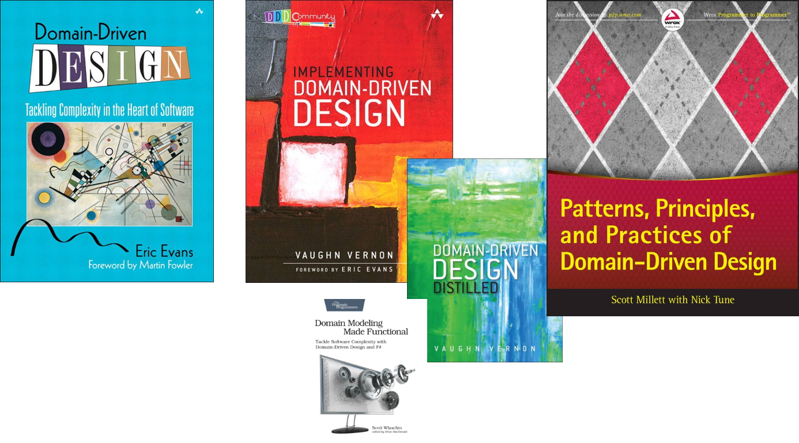

# Value Objects
## on steroids

- <i class="fa fa-user"></i> Patrick Drechsler
- <i class="fa fa-calendar" aria-hidden="true"></i> 25.06.2018
- <i class="fa fa-twitter" aria-hidden="true"></i> @drechsler
- <i class="fa fa-github" aria-hidden="true"></i> github.com/draptik

x---

#### Patrick Drechsler

- "gelernter" Biologe
- C# Entwickler bei Redheads Ltd.
- aktuelle Schwerpunkte: DDD, FP, Cloud
- Softwerkskammer

x---

## Wo geht die Reise hin?

- Was ist ein Value Object?
- Wie nutzt man Value Objects?
- Fallstricke
- Killer Features // <- In die Liste aufnehmen?
- On Steroids

Note: Diese Folie zeigen?

x---

## Domain Driven Design



Note: 
- Alle Buecher (bis auf Distilled) > 500Seiten
- schließt die Kluft zwischen
    - **Fachlichkeit** (Kunden-Vokabular) und 
    - **techn. Implementierung** (IT-Vokabular)

x---

```csharp
public class Konto
{
    public int Kontostand { get; private set; } = 0;

    public void Einzahlen(int betrag) 
    { 
        this.Kontostand += betrag;
    }
}
```

```csharp
[Fact]
public void Kontostand_ist_nach_Einzahlung_groesser_als_davor()
{
    var konto = new Konto();
    var before = konto.Kontostand;
    konto.Einzahlen(-10);
    konto.Kontostand.Should().BeGreaterThan(before);
}
```
